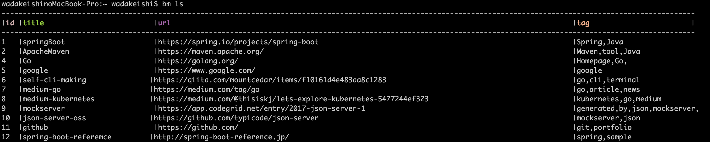
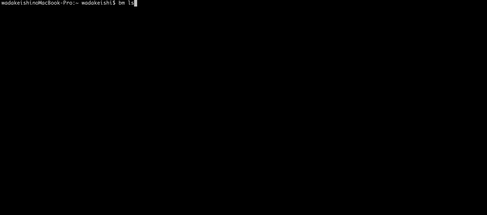
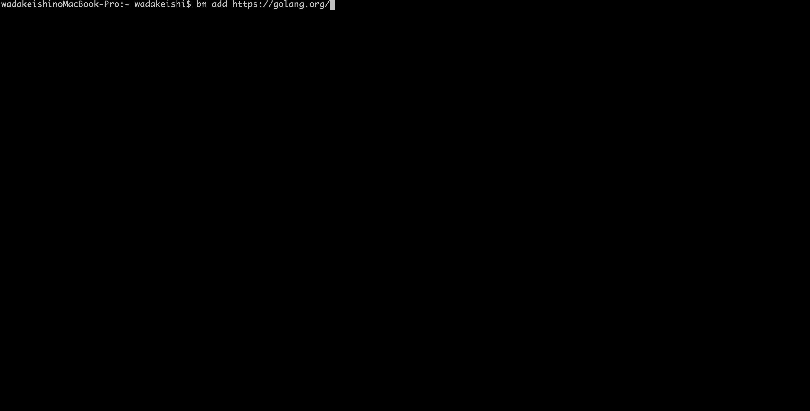
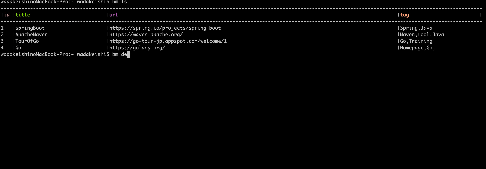
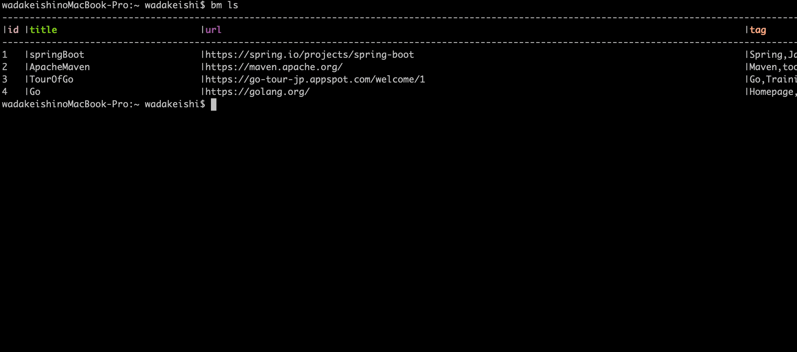

[](https://godoc.org/github.com/kcwebapply/imemo)

[](https://github.com/gin-gonic/gin/releases)
[](https://github.com/kcwebapply/iemo/release)

`bm` is tag-based cli tool for bookmarking.




## Installation

### On macOS

```
brew tap kcwebapply/bm
brew install bm
```

## Usage

### view bookmarks
`bm list` `bm ls`

listing all book. `bm ls` also available.


By `bm ls ${searchWord}` , you can filtering bookmark by title.
By `bm -t ${tagName}` , you can search bookmark by tag name.




### add bookmark
`bm add ${url}`  `bm a ${url}`
you can save bookmark by `bm add` command.



you can set tags (max 3 tags) on your bookmark.


## delete bookmark
`bm delete ${bookmark-id}` `bm d ${bookmark-id}`




To delete bookmark on you list, please input bookmark-id that automatically assigned to all bookmark.

you can confirm bookmark-id by `bm ls` command.

## open bookmark
`bm open ${bookmark-id}`
you can open bookmark from cli.


